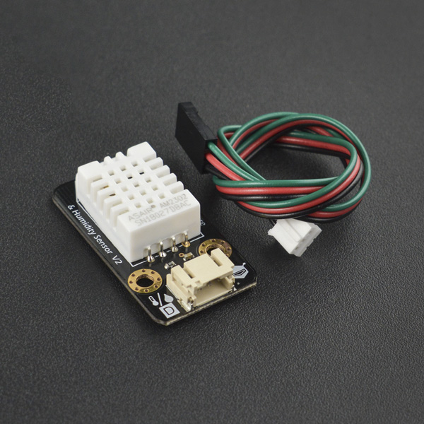

# DFRobot_DHT22
- [中文版](./README_CN.md)

DHT22数字温湿度传感器是一款含有已校准数字信号输出的温湿度复合传感器。它应用专用的数字模块采集技术和温湿度传感技术，确保产品具有极高的可靠性与卓越的长期稳定性。

传感器包括一个电容式感湿元件和一个NTC测温元件，并与一个高性能8位单片机相连接。因此该产品具有品质卓越、超快响应、抗干扰能力强、性价比极高等优点。单线制串行接口，使系统集成变得简易快捷。超小的体积、极低的功耗，信号传输距离可达20米以上，使其成为各类应用甚至最为苛刻的应用场合的最佳选则。产品连接方便，可直接插接到Arduino传感器扩展板上。

DHT22数字温湿度传感器精度较高，可以替代昂贵的进口SHT10温湿度传感器。在对环境温度与湿度测量要求较高的情况下使用，该产品具有极高的可靠性和出色的稳定性。与Arduino专用传感器扩展板结合使用，可以非常容易地实现与温度和与湿度感知相关的互动效果。




## Product Link (https://www.dfrobot.com/product-1102.html)

    SKU: SEN0137

## Table of Contents

  * [Summary](#summary)
  * [Installation](#installation)
  * [Methods](#methods)
  * [Compatibility](#compatibility)
  * [History](#history)
  * [Credits](#credits)

## Summary

This is a library for obtaining ambient temperature and humidity.

## Installation

To use this library, first download the library file, paste it into the \Arduino\libraries directory, then open the examples folder and run the demo in the folder.

## Methods

```C++
  /**
   * @fn getHumidityInt
   * @brief 获取传感器湿度
   * @return  short int 类型，表示返回传感器湿度
   */
  short int getHumidityInt(void);

  /**
   * @fn getTemperatureCInt
   * @brief 获取传感器温度
   * @return  short int 类型，表示返回传感器温度
   */
  short int getTemperatureCInt(void);

  /**
   * @fn clockReset
   * @brief 计时全局变量复位
   */
  void clockReset(void);

  /**
   * @fn getHumidity
   * @brief 获取传感器湿度
   * @return  float类型，表示返回传感器湿度
   */
  float getHumidity(void);

  /**
   * @fn getTemperatureC
   * @brief 获取传感器温度(摄氏度)
   * @return  float 类型，表示返回传感器温度
   */
  float getTemperatureC(void);

  /**
   * @fn getTemperatureF
   * @brief 获取传感器温度(华氏度)
   * @return  float 类型，表示返回传感器温度
   */
  float getTemperatureF(void);

```

## Compatibility

MCU                | Work Well    | Work Wrong   | Untested    | Remarks
------------------ | :----------: | :----------: | :---------: | -----
Arduino uno        |      √       |              |             | 
Mega2560        |      √       |              |             | 
Leonardo        |      √       |              |             | 
ESP32           |      √       |              |             | 
micro:bit        |      √       |              |             | 
ESP8266           |      √       |              |             | 

## History

- 2022/9/7 - Version 1.0.0 released.

## Credits

Written by PengKaixing(kaixing.peng@dfrobot.com), 2022. (Welcome to our [website](https://www.dfrobot.com/))


